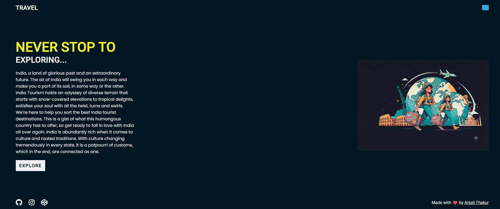

<div align="center">

# 🌍 Tour Website

### ✈️ Explore the World with Us

A modern, responsive and attractive travel website built using **HTML, CSS & JavaScript**.




</div>

---

# 📸 Website Preview

<p align="center">


</p>

---

# 📖 About Project

The **Tour Website** is a responsive and user-friendly travel website developed using **HTML5, CSS3, and JavaScript**.

It provides users with an engaging experience to discover amazing destinations, explore travel packages, and contact the travel agency.

---

# ✨ Features

✅ Beautiful Landing Page

✅ Hero Banner

✅ Popular Destinations

✅ Places Section

✅ Contact Page

✅ Responsive Design

✅ Attractive UI

✅ Mobile Friendly

✅ Smooth Scrolling

✅ Easy Navigation

---

# 🛠 Technologies Used

| Technology | Description |
|------------|-------------|
| HTML5 | Website Structure |
| CSS3 | Styling |
| JavaScript | Interactive Features |
| VS Code | Code Editor |

---

# 📂 Project Structure

```text
Tour-website-main/
│
├── img/
│   ├── hero-img.png
│   ├── screenshot1.png
│   ├── img-1.jpg
│   ├── img-2.jpg
│   ├── img-3.jpg
│   ├── img-4.jpg
│   ├── img-5.jpg
│   └── img-6.jpg
│
├── index.html
├── places.html
├── contact.html
├── style.css
├── places.css
├── contact.css
├── app.js
└── README.md
```

---

# 🚀 Installation

Clone the repository

```bash
git clone https://github.com/your-username/Tour-website.git
```

Go to project folder

```bash
cd Tour-website-main
```

Run using Live Server

```
Open index.html
Right Click
Open with Live Server
```

---

# 📱 Responsive Design

✔ Desktop

✔ Laptop

✔ Tablet

✔ Mobile

---

# 🎯 Future Improvements

- Online Booking System
- User Login & Registration
- Search Destination
- Google Maps
- Payment Gateway
- Dark Mode
- Reviews & Ratings

---

# 👩‍💻 Author

## Anjali Thakur

🎓 MCA Student

💻 Python Developer

🌐 Frontend Web Developer

📍 Madhya Pradesh, India

---

# ⭐ Support

If you found this project helpful, please consider giving it a ⭐ on GitHub.

---

# 📜 License

This project is created for educational and learning purposes.

<div align="center">

### 🌍 Thank You For Visiting ❤️

</div>
